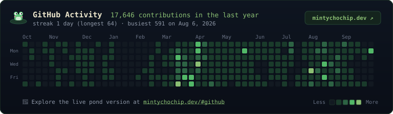

### GitHub activity

I keep an interactive live pond version on **[mintychochip.dev](https://mintychochip.dev/#github)** with animated frogs and daily commit breakdowns. The grid below reflects the same year of contributions in matching frog greens, updated daily.

  

  
  

---

<!-- Proudly created with GPRM ( https://gprm.itsvg.in ) -->
